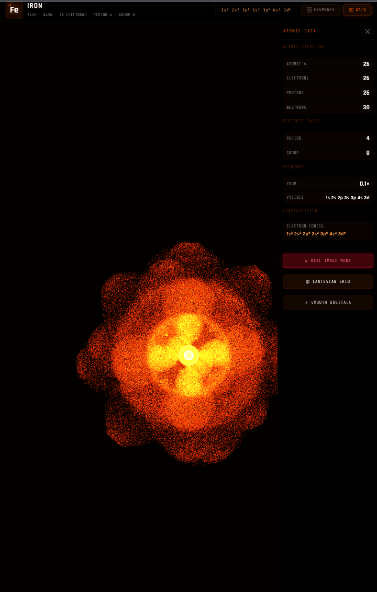

# Quantum Atom Simulator

**A beautiful, interactive 3D visualization of atomic structure, electron orbitals, and quantum probability clouds.**

  


## ✨ Live Demo

[**Open Quantum Atom Simulator**](https://nazat02.github.io/Quantum-Atom/)

---

## 🌟 Features

- **Realistic Quantum Orbitals** — Accurate s, p, and d orbital shapes based on quantum probability distributions
- **Interactive 3D Nucleus** — Protons (red) and neutrons (blue) packed using Fibonacci sphere distribution with internal lighting
- **Dual Rendering Modes** — Grainy detailed mode and Smooth soft mode
- **Real Image Mode** — Special visual style inspired by atomic imaging
- **Full Periodic Table** — Instant element selection with search
- **Educational Data Panel** — Atomic number, electron configuration, period, group, and live orbital info
- **Responsive Cyber-Neon Design** — Optimized for both desktop and mobile (bottom sheets)
- **Smooth Controls** — Mouse/touch drag, scroll/pinch zoom, keyboard navigation

---

## 🛠️ Technologies

- **Three.js** (r128)
- **Custom GLSL Shaders** — High-performance point clouds with additive blending and dynamic sizing
- **Vanilla JavaScript** — Single HTML file architecture (no build tools needed)

---
## 🎮 Controls

| Action                    | Input                              |
|---------------------------|------------------------------------|
| Rotate Atom               | Mouse drag / Touch drag            |
| Zoom                      | Scroll wheel / Pinch gesture       |
| Cycle Elements            | Left / Right Arrow keys            |
| Reset View                | **RESET** button                   |
| Select Element            | Click element in left panel        |
| Search Elements           | Use search bar in Elements panel   |
| Toggle Real Image Mode    | **REAL IMAGE MODE** button         |
| Toggle Cartesian Grid     | **CARTESIAN GRID** button          |
| Toggle Smooth Orbitals    | **SMOOTH ORBITALS** button         |
| Open Elements Panel       | **ELEMENTS** tab                   |
| Open Data Panel           | **DATA** tab                       |

---

**Pro Tips:**
- Drag on the atom to rotate it in 3D
- Scroll to zoom in/out
- Use arrow keys to quickly cycle through elements
- Try **Real Image Mode** + **Smooth Orbitals** for the most beautiful view


---

## 📋 Roadmap

We will keep actively adding new features:

- Extend periodic table up to element 118
- Probability density surfaces (isosurfaces)
- Bohr model toggle
- Ionization states and electron transitions
- High-resolution screenshot export
- Performance/quality settings
- Electron spin visualization
- WebXR Augmented Reality support


---


## 🚀 Getting Started
---
1. **Clone the repository**
   ```bash
   git clone https://github.com/nazat02/Quantum-Atom.git
