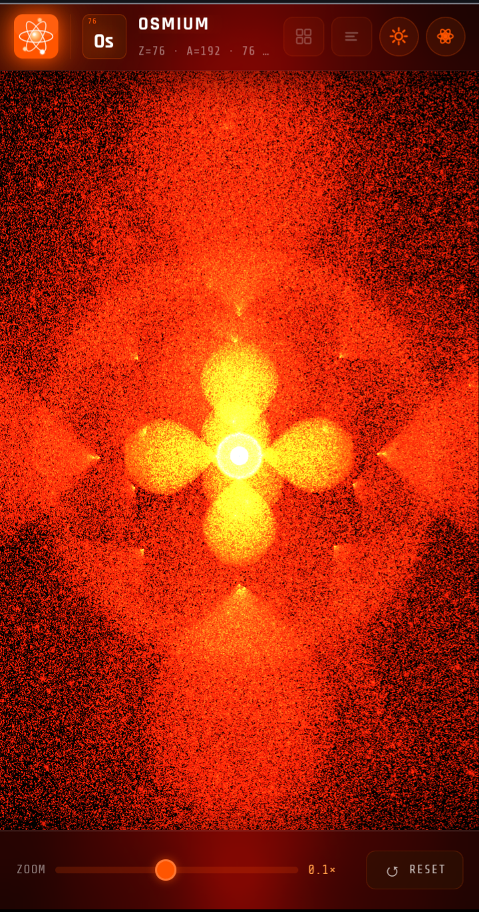

# ⚛️ Quantum Atom Simulator

### See the Invisible.

You've seen the atom drawn a thousand times — a ball in the middle, some smaller balls looping around it like tiny planets. It's a lie we tell in grade school because the truth doesn't fit on a chalkboard.

The truth is stranger and more beautiful: electrons aren't balls on rails. They're probability clouds — fuzzy, glowing regions of *maybe* — and the "orbits" you were taught are really shapes called **orbitals**, sculpted by the math of quantum mechanics. Zoom into the nucleus at the center, and it gets stranger still: protons and neutrons held together by a force so powerful it can only be described as an endless exchange of ghost particles, all the way down to quarks bound by gluons.

**Quantum Atom Simulator** puts that entire universe in your browser. No installs, no plugins, no PhD required — just drag, zoom, and watch matter reveal itself.



## 🌐 Live Demo

**[Launch Quantum Atom Simulator →](https://nazat02.github.io/Quantum-Atom/)**

---

## 🌟 What's Inside

This isn't one tool — it's three, all built to be opened straight from a browser tab, with matching light and dark themes throughout.

### ⚛️ The Atom Simulator
The centerpiece. A real-time 3D renderer that builds **accurate s, p, and d orbital shapes** from genuine quantum probability distributions, using custom GLSL shaders for tens of thousands of glowing points per cloud.

- **The full periodic table — all 118 elements**, from Hydrogen to Oganesson, instantly selectable with live search
- **A living data panel** — atomic number, full electron configuration, period, group, and orbital info that update as you explore
- **A 3D nucleus you can actually see** — protons (red) and neutrons (blue) packed with a Fibonacci sphere distribution and real internal lighting, not a flat sprite
- **Two rendering styles** — a detailed, grainy "raw data" mode and a soft, smooth mode, plus a **Real Image Mode** styled after real atomic imaging
- **A Cartesian grid overlay** for anyone who wants to see the geometry, not just the glow

### 🧪 Molecule Mode
Flip the switch from Atoms to **Molecules** and watch individual electron clouds fuse into real chemical structures — over **50 curated molecules**, from simple diatomics like H₂ and O₂ to shapes every chemistry student has drawn by hand: bent H₂O, trigonal pyramidal NH₃, tetrahedral CH₄, trigonal bipyramidal PF₅, octahedral SF₆, and more. Bond angles and geometry are derived from real VSEPR theory, not hard-coded guesses — so the shapes you see are the shapes molecules actually take.

### 🔬 Nucleus Explorer
A companion tool that does one thing no textbook diagram can: **lets you zoom in forever.**

Start at the whole nucleus and keep scrolling in. First the individual protons and neutrons resolve into view. Keep going, and you'll see the **residual strong force** itself — the constant exchange of virtual pions that glues the nucleus together against its own electric repulsion. Keep going past that, and nucleons dissolve into **quarks bound by gluons**, the actual bottom of the visible matter stack. It's the closest thing to a magnifying glass for the strong nuclear force that exists on the web.

---

## 🛠️ Technologies

- **Three.js (r128)** for all 3D rendering
- **Custom GLSL shaders** — high-performance point clouds with additive blending and dynamic per-point sizing
- **Vanilla JavaScript** — every tool is a single self-contained HTML file, no build step, no bundler, no dependencies to install

---

## 🎮 Controls

| Action                    | Input                              |
|---------------------------|-------------------------------------|
| Rotate Atom                | Mouse drag / Touch drag            |
| Zoom                       | Scroll wheel / Pinch gesture       |
| Cycle Elements              | Left / Right Arrow keys            |
| Reset View                 | **RESET** button                   |
| Select Element              | Click element in left panel        |
| Search Elements             | Use search bar in Elements panel   |
| Switch Atoms / Molecules    | **ATOMS / MOLECULES** mode toggle  |
| Toggle Real Image Mode      | **REAL IMAGE MODE** button         |
| Toggle Cartesian Grid       | **CARTESIAN GRID** button          |
| Toggle Smooth Orbitals      | **SMOOTH ORBITALS** button         |
| Open Elements Panel         | **ELEMENTS** tab                   |
| Open Data Panel             | **DATA** tab                       |

Fully responsive — desktop gets full side panels, mobile gets touch-friendly bottom sheets.

**Pro Tips:**
- Double-click the atom to snap back into auto-spin
- Try **Real Image Mode** + **Smooth Orbitals** together for the most cinematic view
- In Nucleus Explorer, just keep scrolling in — the physics changes as you go

---

## 📋 Roadmap

Actively growing. Up next:

- Probability density isosurfaces
- Bohr model toggle for side-by-side comparison with the classic (wrong) picture
- Ionization states and electron transitions
- High-resolution screenshot export
- Performance / quality presets
- Electron spin visualization
- WebXR augmented reality support

---

## 🚀 Getting Started

Because every tool is a single HTML file, there's nothing to build and nothing to install.

1. **Clone the repository**
   ```bash
   git clone https://github.com/nazat02/Quantum-Atom.git
   ```
2. **Open it**
   ```bash
   cd Quantum-Atom
   open index_dark.html   # or index_light.html
   ```
   Any modern browser works — just double-click the file, or serve the folder with any static file server.

---

## 📄 License

Released under **[CC BY-SA 4.0](https://creativecommons.org/licenses/by-sa/4.0/)** (Attribution-ShareAlike). Use it, remix it, build on it — even commercially — as long as you credit **nazat02** and release your version under this same license. See `LICENSE.txt` for the full terms.

---

### Why this exists

Most atom visualizers are either scientifically hand-wavy cartoons or dense simulation software that only a physicist could love. Quantum Atom Simulator was built to sit in the gap — real quantum-derived geometry, real chemistry, real nuclear physics, wrapped in something you can hand to a curious 12-year-old or a chemistry professor and have both walk away impressed.

Drag. Zoom. See what you're actually made of.
