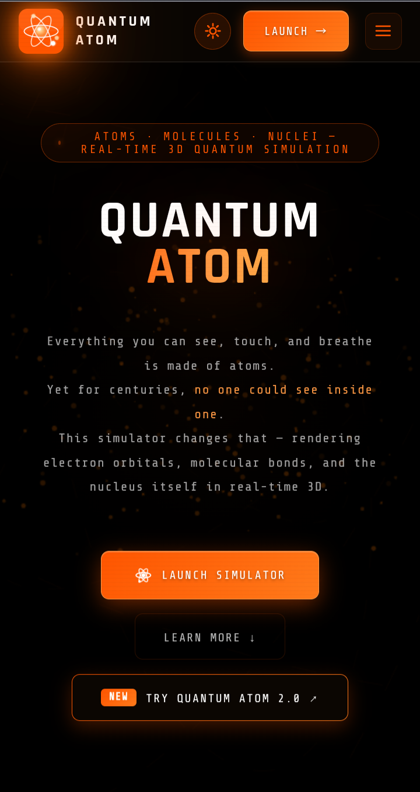
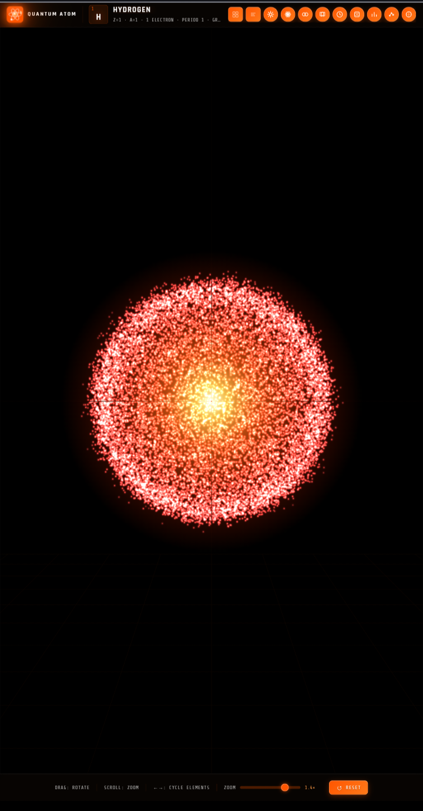
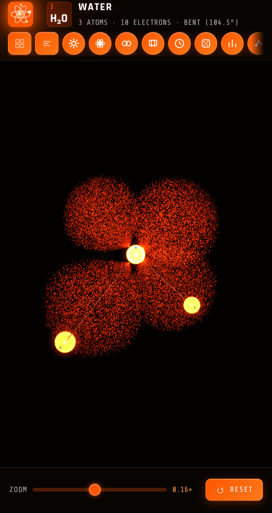
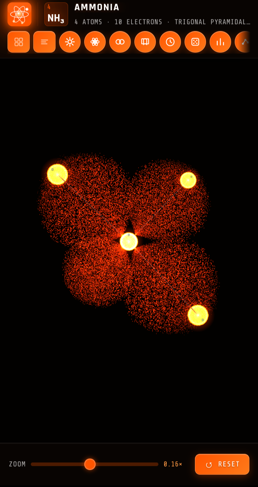
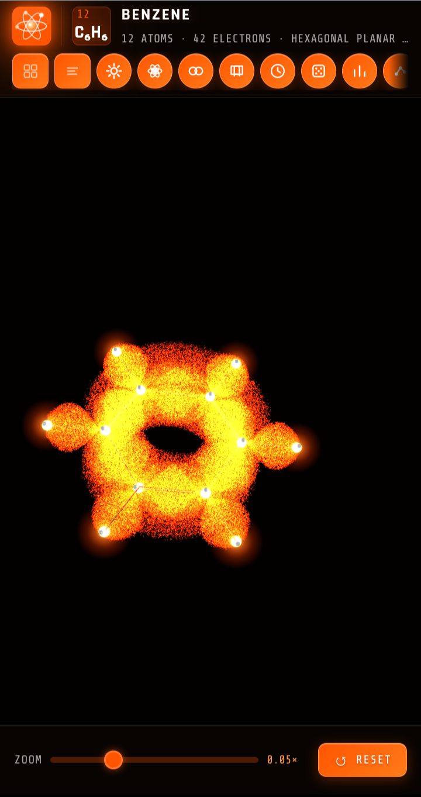
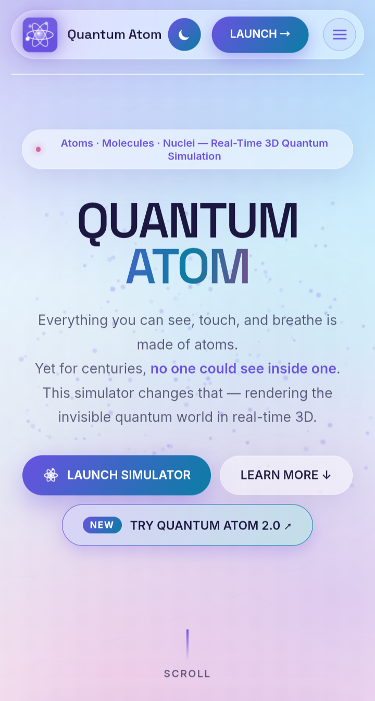
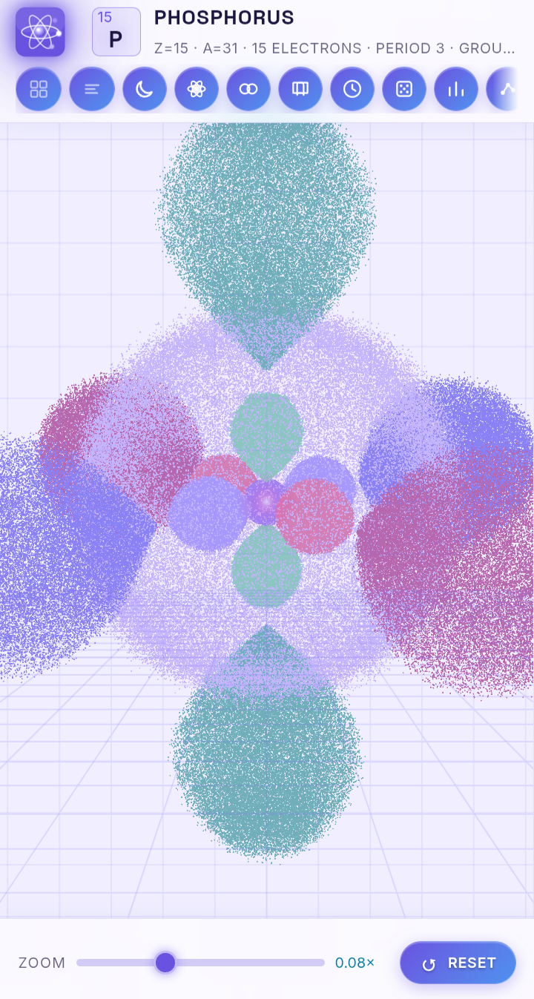

<div align="center">

# ⚛️ Quantum Atom

### Everything you were taught about the atom was a drawing.<br>This is the real thing.

**The world's first Quantum Atom Simulator that runs all 118 elements in one browser, free.**<br>A new way to learn chemistry: see real orbitals, real molecules and real nuclei in 3D, with no install and no account.

[**▶ Launch the Simulator**](https://nazat02.github.io/Quantum-Atom/) &nbsp;·&nbsp; [The Story](#-the-story) &nbsp;·&nbsp; [Features](#-what-you-can-do) &nbsp;·&nbsp; [Run It](#-run-it-in-30-seconds)

<br>



<table>
<tr>
<td></td>
<td></td>
<td></td>
</tr>
<tr>
<td></td>
<td></td>
<td></td>
</tr>
</table>

</div>

---

## 💔 The problem

Remember the atom from school? A dot in the middle. A few smaller dots circling it like tiny planets.

**It's wrong.** Your teacher knew it was wrong. The textbook knew it was wrong. It stayed on the page because the truth is hard to draw, and nobody gave you a better picture.

So a whole generation grew up believing:

- electrons *orbit* the nucleus (they don't),
- atoms are *mostly solid stuff* (they're almost entirely empty),
- chemistry is *memorization* (it's geometry you were never shown).

The result is the same everywhere: students who can recite "2, 8, 8, 18" but can't tell you **why water is bent**, why **helium never reacts**, or why **neon signs glow orange**. They memorize the answer because they never got to *see* the question.

And the tools that *do* show the truth? Heavy desktop software. Research-grade, licence-gated, and built for people who already understand it.

> **There was nothing in between. Something you could open in a browser, in ten seconds, and just *get it*.**

---

## ✨ The idea

**Quantum Atom is that something.**

Open a link. Pick any element. Watch its electrons appear, not as dots on rails, but as what they really are: glowing clouds of probability, shaped by the mathematics of quantum mechanics. Spheres. Dumbbells. Cloverleaves. Rings.

Then keep going.

- Snap two atoms together and watch a **molecule** form.
- Type the name of *anything* and **build it**.
- Dive into the **nucleus**, past the protons and neutrons, down to the **quarks**.
- Flip a switch and see the **antimatter** version of the same thing.

No install. No account. No equations required. Drag to rotate, scroll to zoom, and the invisible becomes something you can hold in your hands.

---

## 🌍 Why it matters

**Quantum Atom is the world's first Quantum Atom Simulator to run all 118 elements in a single browser, completely free.** It puts **every one of the 118 elements** (hydrogen to oganesson) into **a single browser tab**, rendered as real 3D quantum orbitals, and **it's free**. No software to install, no licence to buy, no account to make. If you have a link and a browser, you have a quantum laboratory.

**A revolution in how chemistry can be learned.** Chemistry has always been taught as rules to memorize. Quantum Atom turns it into something you *watch happen*:

| Chemistry has always said… | Quantum Atom lets you **see**… |
|---|---|
| "Electrons fill shells in a set order." | The shells filling, element by element, from H to Og. |
| "Noble gases are stable." | A full outer shell, glowing and complete. |
| "Water is bent." | The geometry that forces the bend, with angles from VSEPR theory. |
| "Orbitals are s, p and d." | The spheres, dumbbells and cloverleaves themselves. |
| "The nucleus is protons and neutrons." | Them, packed together, and the quarks inside them. |
| "Matter has an antimatter twin." | That twin, side by side with the original. |

### How it compares

| | Textbook diagram | Desktop research software | **Quantum Atom** |
|---|:---:|:---:|:---:|
| Shows real orbital shapes | ❌ | ✅ | ✅ |
| All 118 elements | ✅ (as a table) | varies | ✅ (in 3D) |
| Runs in a browser, no install | ✅ | ❌ | ✅ |
| Free | ✅ | usually ❌ | ✅ |
| Made for beginners | ✅ | ❌ | ✅ |
| Interactive, rotate and zoom | ❌ | ✅ | ✅ |
| Atoms, molecules *and* nuclei in one place | ❌ | ❌ | ✅ |

---

## 📖 The story

Quantum Atom is built as a journey with four chapters. Each one answers a question you've probably wondered about and never had the picture for.

| | Chapter | The question it answers |
|---|---|---|
| **1** | **The Atom** | *"What does an electron actually look like?"* |
| **2** | **The Molecule** | *"Why do atoms stick together, and why are the shapes what they are?"* |
| **3** | **The Nucleus** | *"What's inside the middle?"* |
| **4** | **The Mirror** | *"What if everything were made of antimatter?"* |

The landing page walks you through this the way it unfolded in history: from **Democritus** guessing in 400 BCE, to **Dalton's** billiard balls, **Thomson's** plum pudding, **Rutherford's** gold-foil shock, **Bohr's** planetary orbits, and finally **Schrödinger, Heisenberg and Born**, who threw out the orbits altogether. Two thousand four hundred years of "we were close, but wrong," and then, for the first time, you can see where it ended up.

---

---

## 🎯 What you can do

### Understand it
- 🎓 **Guided Lessons.** Three short, step-by-step paths: *Understanding Covalent Bonds*, *VSEPR: Why Molecules Have Shapes*, and *Building Up the Periodic Table*. Each step moves the scene for you and explains what you're looking at in a sentence or two.
- 🆚 **Compare Elements.** Put two elements side by side and see how they differ.
- 🔬 **Molecule Analysis.** Dig into the structure of the molecule on screen.
- 📜 **The Bohr vs. Quantum showdown.** A side-by-side on the landing page of the model everyone learns and the one that's actually true.

### Explore it
- 🧪 **All 118 elements**, hydrogen to oganesson, with live search and arrow-key cycling.
- 🧬 **52 molecules**, plus **Build mode** for anything else.
- ⚡ **Excited State.** Promote electrons to higher orbitals and watch the transition.
- 🎲 **Surprise Me.** Land on something random. Rabbit holes guaranteed.
- 🕘 **Recently Viewed.** Jump back to what you were just looking at.

### Make it yours
- 🌗 Light and dark themes
- 🎨 Colorblind-safe palette
- 🔮 Real Image · Ultra · Smooth · Spherical · Cartesian Grid
- 🪞 Antimatter mode, for atoms *and* molecules

### Go all the way down
- 🔭 **Nucleus Explorer.** Continuous zoom from nucleus to quarks, with toggleable **pion exchange** and **gluon field** overlays, a color legend, and element-by-element navigation.

---

## 🧭 A quick tour: your first five minutes

1. **Open the app and pick hydrogen.** One electron, one perfect sphere. This is the simplest atom in the universe.
2. **Press → to step through the table.** Watch helium complete the first shell, then lithium start a new one. That's *why the periodic table has rows*.
3. **Jump to carbon or oxygen.** Now you'll see the dumbbell-shaped **p orbitals** appear.
4. **Try a transition metal like iron.** Now the cloverleaf-shaped **d orbitals** show up.
5. **Switch to Molecules and open water.** See the bend, then run the **VSEPR lesson** to learn why.
6. **Finish in the Nucleus Explorer.** Keep scrolling until you hit quarks.

By the end you've covered most of a first-year chemistry course, visually.

## 🔤 The three shapes, in plain words

| Orbital | Shape | What it means |
|---|---|---|
| **s** | A sphere | The simplest cloud, same in every direction. Every atom has them. |
| **p** | A dumbbell (three of them, at right angles) | Where much of chemistry happens: bonding in carbon, nitrogen, oxygen. |
| **d** | A cloverleaf (five of them) | The reason transition metals have colour, magnetism and catalytic power. |

## ❓ FAQ

**Is it really free?** Yes. Open the link and use it.

**Do I need to install anything?** No. It runs in any modern browser.

**Does it work on a phone?** Yes, with touch rotate and pinch-to-zoom.

**Are the shapes real or artistic?** The orbitals are drawn from quantum probability distributions, so they're the shapes the theory predicts, not decoration.

**Can I use it in a class?** For learning, yes, by opening the official link. For hosting it elsewhere or any commercial use, see [License & Credit](#-license--credit).

**Why do orbitals look like fuzzy clouds?** Because an electron doesn't have an exact position. The cloud shows *where it's likely to be*.

---

## 👥 Who it's for

| If you are… | Quantum Atom gives you… |
|---|---|
| **A student** | The picture your textbook never had. Stop memorizing, start seeing. |
| **A teacher** | A projector-ready demo that works from a link, with built-in lessons. No installs, no logins, no lab licences. |
| **A curious person** | Ten minutes of *"wait, really?"* that you'll tell someone about tonight. |
| **A developer or designer** | A readable, single-file WebGL project to study and learn from. |

---

## 🚀 Run it in 30 seconds

**Easiest:** open the [live demo](https://nazat02.github.io/Quantum-Atom/). Nothing else needed.

**Locally:** every tool is a single self-contained HTML file. There is no build step, no bundler and no dependency install.

```bash
git clone https://github.com/nazat02/Quantum-Atom.git
cd Quantum-Atom
open index_dark.html      # or index_light.html
```

Double-click works. So does any static file server. Use **Launch** to reach the Simulator, and the nucleus icon inside it to reach the Nucleus Explorer.

> 💡 *The 3D engine (three.js) and fonts load from a CDN, and Build mode's online lookups need a connection, so the first run should be online.*

---

## 🎮 Controls

### Atom & Molecule Simulator

| Action | Input |
|---|---|
| Rotate | Mouse drag · Touch drag |
| Zoom | Scroll · Pinch · Zoom slider |
| Cycle elements | ← / → arrow keys |
| Pick an element or molecule | **EXPLORE** panel (Atoms · Molecules · Build) |
| Search | Search bar in the element panel |
| Atomic data | **DATA** panel |
| Reset view | **RESET** |
| Toggle modes | **ANTIMATTER · REAL IMAGE · CARTESIAN GRID · SMOOTH ORBITALS · ULTRA MODE · SPHERICAL MODE · EXCITED STATE** |
| Lessons · Compare · Recents · Surprise · Analysis · Colorblind | Toolbar icons (top right) |
| Open Nucleus Explorer | Nucleus icon in the toolbar |

### Nucleus Explorer

| Action | Input |
|---|---|
| Zoom nucleus → quarks | Slider · Scroll · Pinch |
| Previous / next element | **‹ ›** |
| Jump to any element | **ELEMENTS** |
| Pion exchange / gluon field | **PIONS** / **GLUONS** |
| Reset camera | **RESET** |
| Legend · Help | Legend button · **?** |

**Pro tips**
- Double-click the atom to snap back into auto-spin.
- **Real Image + Smooth Orbitals** is the most cinematic combination. **Ultra Mode** is the cleanest.
- In the Nucleus Explorer, *just keep scrolling.* The physics changes as you go.
- Run the **VSEPR lesson** end to end. It's the fastest way to see why molecules have the shapes they do.

---

## 🧱 Under the hood

For the builders. Everything is deliberately simple.

- **three.js r128** for 3D rendering
- **Custom GLSL shaders** for point-cloud orbitals (additive blending, per-point sizing) and Fresnel-shaded mesh surfaces in Ultra Mode
- **Vanilla JavaScript**, one self-contained HTML file per tool
- **Zero build step.** What you read is what runs.

```
Quantum-Atom/
├── index.html                  # theme-aware redirect to the landing page
├── index_dark.html             # landing page: the story, history, Bohr vs Quantum
├── index_light.html
├── simulator_dark.html         # atoms · molecules · build · lessons · compare · analysis
├── simulator_light.html
├── nucleus_explorer.html       # nucleus → nucleons → quarks
├── nucleus_explorer_light.html
└── images/
```

---

## 🗺️ Roadmap

- Probability-density isosurfaces
- Ionization states and electron transitions
- Electron spin visualization
- High-resolution screenshot export
- Performance and quality presets
- WebXR augmented reality: *put an orbital on your desk*

---

## 📄 License & Credit

**© Md. Shaikhul Hadis Nazat. All rights reserved.**

Quantum Atom is made for **learning and personal use only**.

| ✅ You may | ❌ You may not |
|---|---|
| Open it, explore it, and learn from it | Host or re-publish it on any other domain or platform |
| Use it for your own personal study | Use it commercially in any way without a **written license** from the author |
| Share the official link with friends and classmates | Copy, redistribute, sell or repackage the files or the code |

Want to use it commercially, host it elsewhere, or build on it? **Ask first, and get written permission.**

**Created by Md. Shaikhul Hadis Nazat** (GitHub: [nazat02](https://github.com/nazat02)).

See `LICENSE.txt` for the full terms.

---

<div align="center">

### The atom was never a drawing.

**[▶ Open Quantum Atom](https://nazat02.github.io/Quantum-Atom/)**, and see what you're made of.

*If it made you say "oh, wow," give it a ⭐ and send it to someone who's still picturing tiny planets.*

</div>
